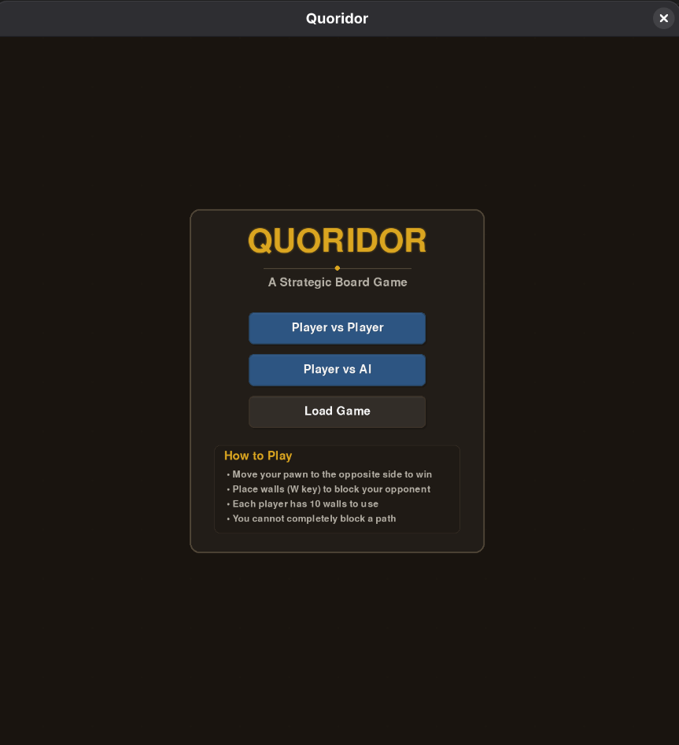
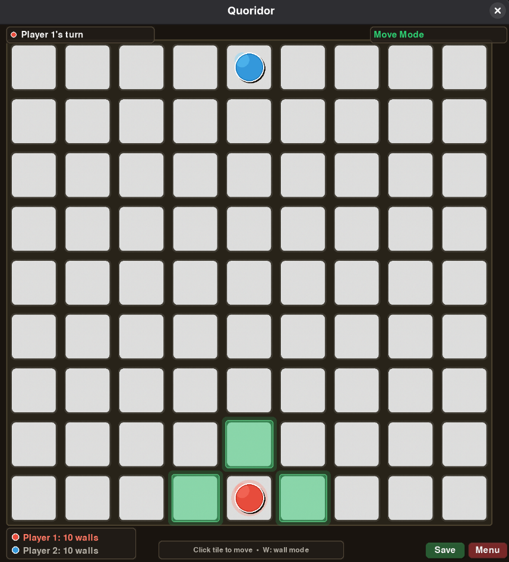
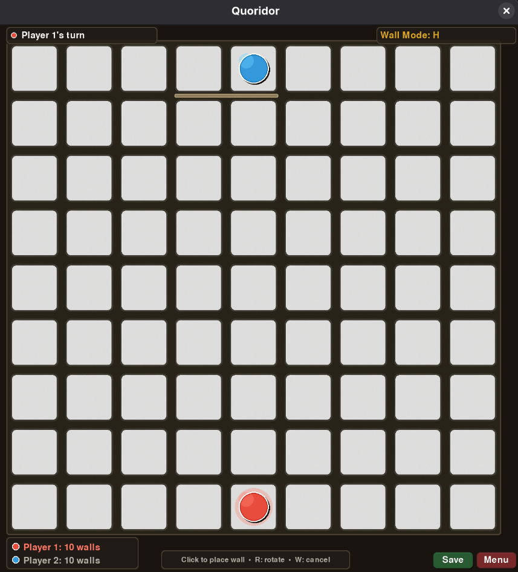

# Quoridor Game

A modern **Quoridor** implementation in **Python + pygame**.

Quoridor is a 2-player strategy board game where each player tries to be the first to reach the opposite side of the board. On your turn you can either move your pawn **or** place a wall to slow your opponent (walls can’t completely block all paths).

This project supports:
- **Player vs Player** (local)
- **Player vs AI** (difficulty selection)
- **Save / Load** game state

## Screenshots

| Menu | Gameplay |
| --- | --- |
|  |  |

| Wall Placement |
| --- | --- |
|  |

## Installation

**Requirements**
- Python **3.12+**

### Option A: `uv` (recommended)

```bash
uv sync
```

### Option B: `pip` + venv

```bash
python3 -m venv .venv
source .venv/bin/activate
python -m pip install --upgrade pip
python -m pip install .
```

## Run

```bash
python main.py
```

If you installed with `uv`:

```bash
uv run python main.py
```

## Controls

### Menu
- **Mouse (left click)**: choose `Player vs Player`, `Player vs AI`, or `Load Game`
- **ESC**: go back / exit

### In Game
- **Mouse (left click)**:
	- Move: click a highlighted tile
	- Wall mode: click to place a wall
- **W**: toggle wall placement mode (and cancel wall mode)
- **R**: rotate wall orientation (`H` ↔ `V`) while in wall mode
- **Save** button: save the current game
- **Menu** button: return to main menu
- **ESC**: return to menu

### Load Game Screen
- **Mouse wheel**: scroll through saves
- **Mouse (left click)**: load selected save
- **ESC / Back**: return to menu

## Demo Video